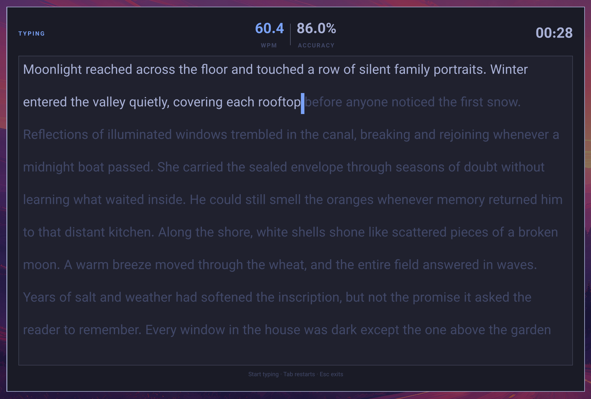
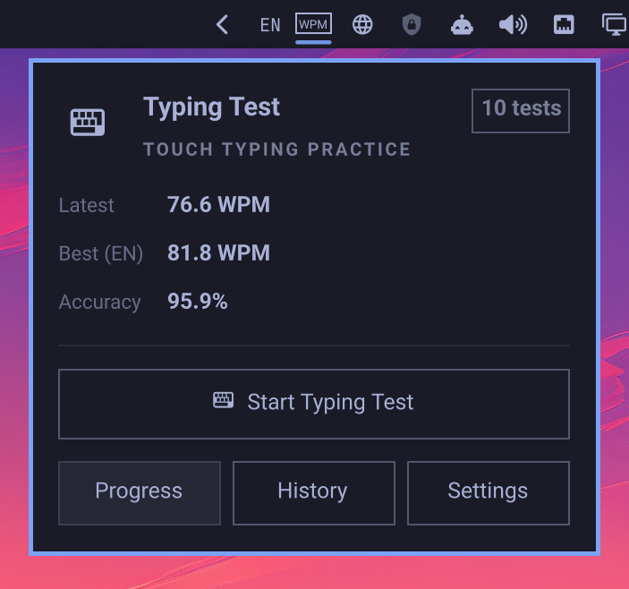
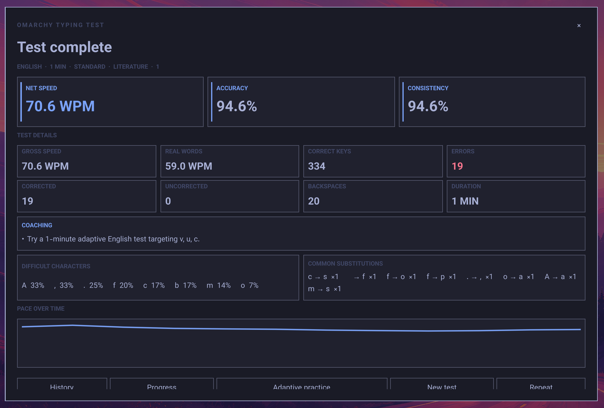
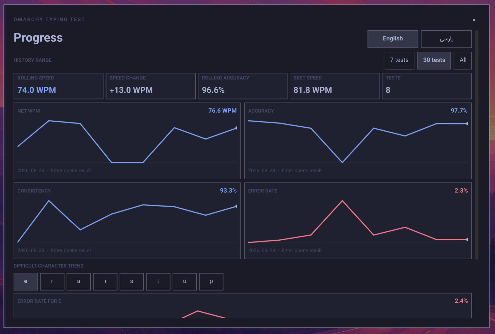
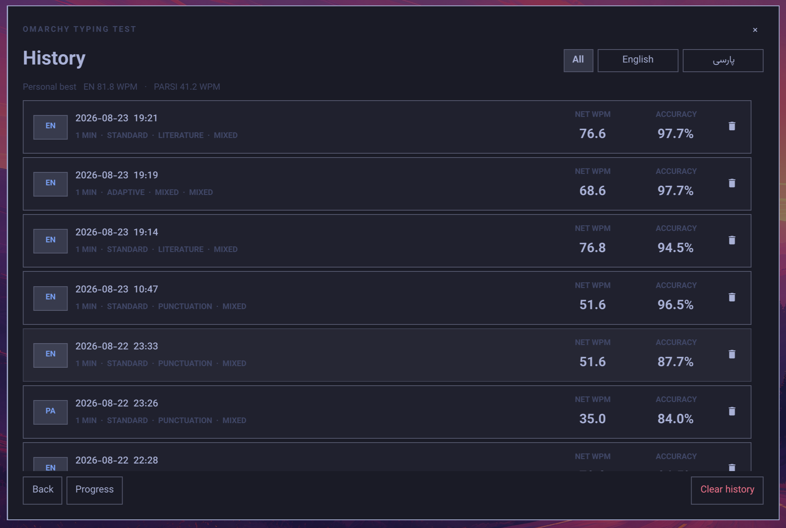

# Omarchy Typing Test

A local-first Omarchy 4 typing test by LeoMoon Studios with English and Parsi
passages, timed and completion-based tests, detailed error analysis, and history.

## Preview

**Typing test**



**Statistics popout**



**Detailed results**



**Progress**



**History**



## Features

- Omarchy bar widget with latest WPM, personal best, accuracy, and test count
- Centered, keyboard-focused typing panel
- Stationary typing pages that replace only after the displayed page is complete
- English and Parsi input with correct LTR/RTL presentation
- 1, 3, 5, and 10 minute presets plus custom durations
- Fixed 10, 25, 50, and 100-word tests
- Full-passage completion tests with an elapsed timer and no countdown
- Separate result actions for retrying the exact passage or choosing a new passage with the same settings
- Adaptive English and Parsi practice based on recent difficult characters, pairs, words, and hesitations
- Local coaching summaries with practical next-test recommendations
- Progress charts for WPM, accuracy, consistency, errors, and character trends
- English and Parsi keyboard heatmaps with per-key speed, opportunities, and error rate
- Targeted drills for a key, hand, finger, or the current comparison's weakest keys
- 400 bundled passages: 200 English and 200 Parsi
- Gross WPM, net WPM, literal WPM, accuracy, and consistency
- Corrected/uncorrected errors plus difficult-character, bigram, word, and hesitation analysis
- Targeted practice using aggregate patterns from previous tests
- Local JSON/JSONL settings and history
- UTF-8 `.txt` passage imports
- Bundled Vazirmatn font for consistent English and Parsi rendering
- No accounts, telemetry, or network requests

## Test Content

| Language | Categories |
| --- | --- |
| English | Common, Literature, Programming, Numbers & punctuation, Difficult-character practice, Imported, Mixed |
| Parsi | Common, Formal, Literature, Numbers & punctuation, Difficult-character practice, Imported, Mixed |

Standard tests support Easy, Medium, Hard, and Mixed difficulty levels.

## Requirements

- Omarchy 4
- The standard `omarchy-shell` packages included with Omarchy
- Python 3 (used for descriptor-bound local data reads and atomic writes)

## Install

Once this repository is published, install it with:

```bash
omarchy plugin add https://github.com/leomoon-studios/omarchy-typing-test.git --enable
```

Omarchy installs the repository into:

```text
~/.config/omarchy/plugins/leomoon-studios.omarchy-typing-test/
```

The widget defaults to the right section of the bar. It can be moved with the
normal Omarchy bar controls.

## Use

Click the outlined WPM badge in the Omarchy bar. The popout shows quick statistics
and actions for starting a test, viewing progress or history, and opening settings.
Tests run inside a larger centered overlay.

Choose **Timed**, **Words**, or **Passage** on Setup. Timed tests end when the
countdown expires, word tests end after the selected number of words, and passage
tests end after one complete source passage. Adaptive practice is available for
timed and word-count tests.

The popout is keyboard navigable: use the arrow keys to select an action,
`Enter` or `Space` to open it, and `Escape` to close the popout.

Setup, History, Progress, and Settings are also keyboard navigable. Arrow keys
move between controls, `Enter` or `Space` activates the focused control, and
all confirmation dialogs support arrow selection, `Enter`/`Space`, and `Escape`.
Inside History, `Up`/`Down` moves through results and `Delete` opens the delete
confirmation. Focused controls and result cards use the active theme cursor.

Choose **Adaptive Practice** on Setup to build a test around recent difficult
characters. Adaptive analysis is kept separate for English and Parsi and unlocks
after three tests in that language when a character has enough useful history.
Completed tests include a short local coaching summary, while Progress shows
language-specific trends and keyboard heatmaps without sending history anywhere.
The heatmap follows the active comparison filters. Select any key directly, or
start a drill for one hand, one finger, or the weakest measured keys.

On Results, choose **Retry same passage** to reconstruct the test from its saved
passage IDs, or **New passage, same settings** for a fresh selection. If a saved
import has since been removed, the retry automatically selects another available
passage and displays a fallback notice.

Keyboard controls during a test:

- Start typing: begin the countdown or elapsed timer
- `Backspace`: correct the previous character
- `Tab`: open restart confirmation after typing has begun
- `Left`/`Right` (or `Up`/`Down`): select Cancel or Restart in the confirmation
- `Enter`/`Space`: activate the selected confirmation action
- `Escape`: close, with confirmation after typing has begun

The centered panel can also be opened directly:

```bash
omarchy-shell shell summon leomoon-studios.omarchy-typing-test '{"view":"setup"}'
```

Supported views are `setup`, `progress`, `history`, and `settings`.

## Local Data

```text
~/.config/leomoon-studios.typing-test/settings.json
~/.config/leomoon-studios.typing-test/settings-recovery.json
~/.local/share/leomoon-studios.typing-test/history.jsonl
~/.local/share/leomoon-studios.typing-test/history-backup.jsonl
~/.local/share/leomoon-studios.typing-test/history-recovery.jsonl
~/.local/share/leomoon-studios.typing-test/custom-texts/
```

`XDG_CONFIG_HOME` and `XDG_DATA_HOME` are honored when set. Full passages,
free-form typed input, and individual hesitation events are not stored in history.
History keeps bounded aggregate counts and rates for difficult characters,
character pairs, words, and pause-heavy keys. Recovery files are created only when
malformed data is found. The latest history snapshot before deleting one or all
results is kept in `history-backup.jsonl`. Storage failures are shown in the plugin
instead of being silently ignored.

## Removal

Unload the plugin and remove its installed checkout:

```bash
omarchy plugin remove leomoon-studios.omarchy-typing-test --yes
```

Omarchy intentionally leaves the plugin's settings, history, and imported
texts in place so they remain available after a reinstall. To permanently
remove that data too:

```bash
rm -rf ~/.config/leomoon-studios.typing-test
rm -rf ~/.local/share/leomoon-studios.typing-test
```

## Import Text

Open Settings, choose a language and collection name, then select a UTF-8
`.txt` file. Blank lines separate passages. Imports are limited to 10 MiB and
symbolic links are rejected.

## Bundled font

Vazirmatn Regular v33.003 is bundled and used throughout the bar widget,
statistics popover, centered panel, controls, results, and typing surface. It
does not depend on a system-installed Parsi font.

Vazirmatn is distributed under the SIL Open Font License 1.1. Its unmodified
license and author list are included in `assets/fonts/`.

## Development

Validate the plugin manifest and entry points:

```bash
omarchy plugin validate .
```

Lint QML against the installed Omarchy shell modules:

```bash
qmllint -I /usr/share/omarchy/shell \
  BarWidget.qml StatsPopover.qml DataStore.qml PassageLibrary.qml \
  TypingTestPanel.qml components/*.qml
```

Run logic and corpus tests:

```bash
node tests/run-tests.mjs
```

## Licensing

The plugin source is MIT licensed. The bundled passage corpus is dedicated
under CC0 1.0; see [texts/SOURCES.md](texts/SOURCES.md). Vazirmatn retains its
SIL Open Font License 1.1 terms; see [THIRD_PARTY_NOTICES.md](THIRD_PARTY_NOTICES.md).
